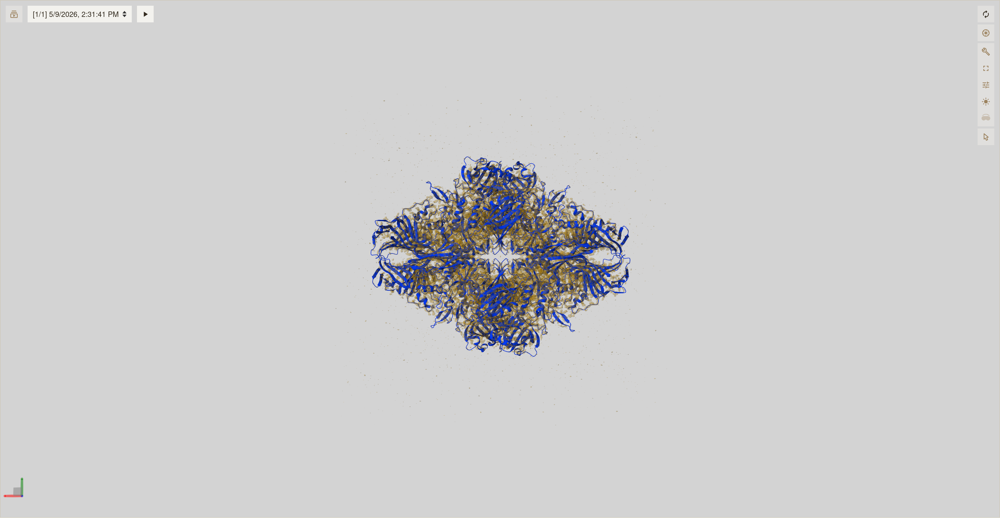
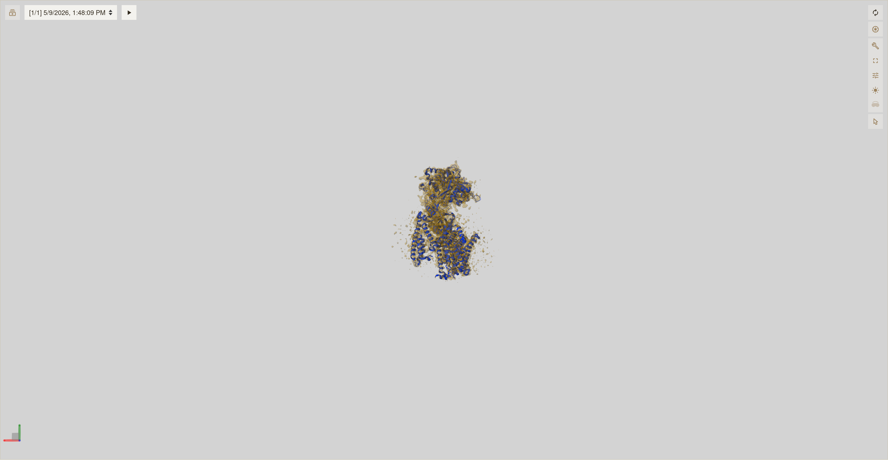
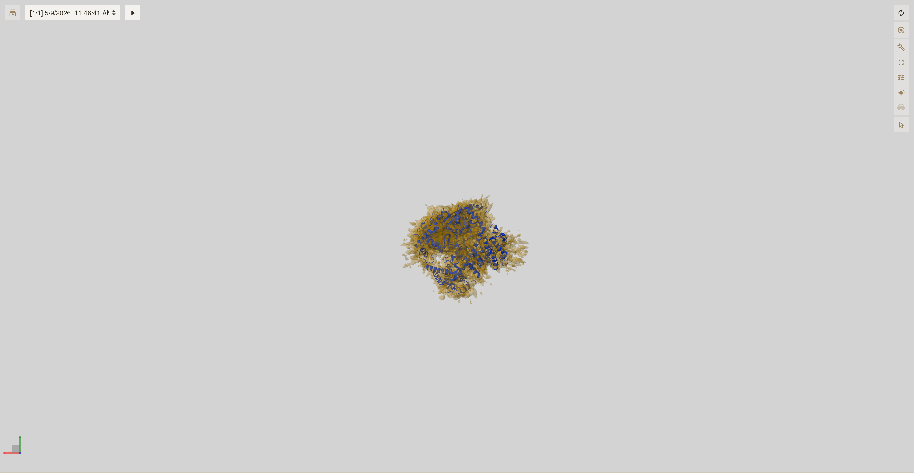
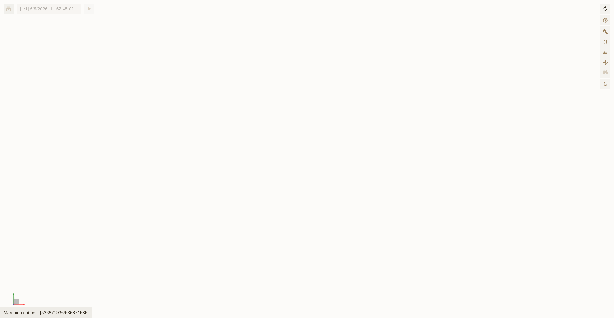
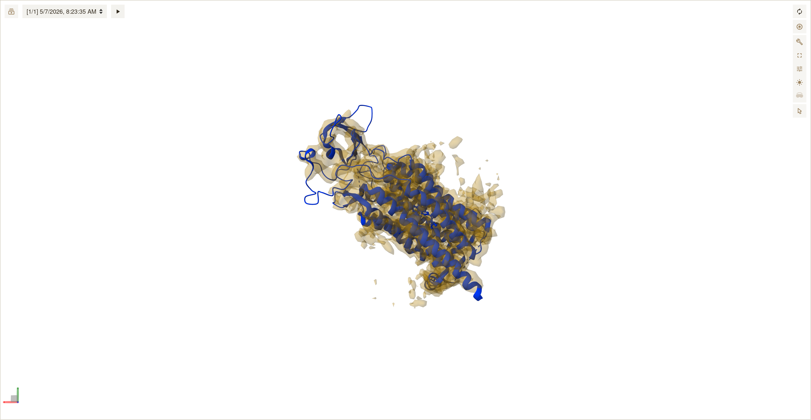
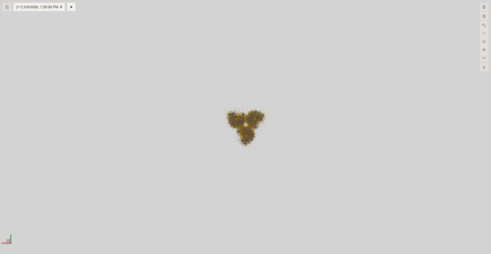

# molviewspec-validation


MolViewSpec-based 3DEM validation visualization for [IHMValidation](https://github.com/salilab/IHMValidation). Replaces the ChimeraX dependency for generating structural views in the validation pipeline ([issue #127](https://github.com/salilab/IHMValidation/issues/127)).

## Sample renders (v0.2.0)

Map and model views at depositor-recommended contour levels, fetched from the EMDB API and passed as absolute contour values to Mol*, matching the VA ChimeraX surfaceview approach (raw .map files cached locally).

| 5A1A / EMD-2984 | 5A63 / EMD-3061 | 9MKW / EMD-48340 |
|:---:|:---:|:---:|
|  |  |  |

| 9NU5 / EMD-49797 | 9R0I / EMD-53483 | 9SYV / EMD-55355 |
|:---:|:---:|:---:|
|  |  |  |

These six entries demonstrate the EMDB recommended-contour fetch and absolute-isovalue rendering across a range of map density scales. See [CHANGES.md](CHANGES.md) for the full v0.2.0 changelog and [BATCH_RESULTS.md](BATCH_RESULTS.md) for results across all 28 benchmark entries.

## Features

**Scene types**

- Map-model fit: structure plus density isosurface (replaces `*_xsurface.jpeg`)
- Q-score colored: VA black-to-blue palette (#000000 → #0D00FF), replaces `*_xqscoresurface.jpeg`
- Atom inclusion colored: VA red-to-cyan palette (#7A0000 → #7AFFFF, matches VA `__floatohex`), replaces `*_xfitsurface.jpeg`

**Rendering**

- Three orthogonal views (X, Y, Z) with auto-centering
- HD static images (3840x1990) via Firefox + Selenium with WebGL through Xvfb
- Interactive HTML with embedded Mol* viewer
- Density rendering from raw .map files (cached locally) using absolute contour values from the EMDB API

**VA data integration**

- Reads per-residue atom inclusion scores from VA JSON output
- Creates custom CIF with scores in B-factor column
- Colors structure using actual validation data, matching the `__floatohex` formula used in VA

## Usage

### Generate interactive HTML views

```python
from molviewspec_validation import generate_all_views
outputs = generate_all_views("5A1A", "EMD-2984", output_dir="views/")
```

### Use real VA atom inclusion data

```python
from molviewspec_validation import (
    parse_va_residue_inclusion, create_scored_cif,
    cif_to_data_url, create_va_inclusion_scene,
)
scores = parse_va_residue_inclusion("emd_2984.map_residue_inclusion.json")
create_scored_cif("5a1a.cif", "5a1a_scored.cif", scores)
data_url = cif_to_data_url("5a1a_scored.cif")
builder = create_va_inclusion_scene(data_url, "EMD-2984", view="z")
```

### Integration with IHMValidation em.py

```python
from molviewspec_validation import generate_validation_images
images = generate_validation_images("5A1A", "EMD-2984")
fit_plots['map_model'] = images['map_model']
fit_plots['map_model_q'] = images['map_model_q']
fit_plots['map_model_inclusion'] = images['map_model_inclusion']
```

## Validation

Run the full test suite:
python tests/run_validation.py

| Test | Entries | Files | Result |
|---|---|---|---|
| HTML generation (map_model + qscore, three views each) | 28/28 | 168 | All pass |
| VA data pipeline (real inclusion scores, three views) | 28/28 | 84 | All pass |
| Edge cases (small, large, nucleic acid, low-variance, low-res) | 5/5 | 15 | All pass |
| **Total** | | **267** | **61 tests, 0 failures** |

See [BATCH_RESULTS.md](BATCH_RESULTS.md) for the full benchmark table.

## Architecture
molviewspec_validation/
init.py       Package exports
scenes.py         MolViewSpec scene builders (5 scene types)
screenshot.py     Headless Firefox HD PNG export
integration.py    Drop-in interface for em.py
va_data.py        VA JSON parsing and custom CIF creation
emdb_api.py       EMDB REST API client for contour levels
tests/
run_validation.py Reproducible 61-test validation suite
benchmark_dataset.csv  28 entries with metadata

## Dependencies

- molviewspec >= 1.0
- gemmi (CIF manipulation)
- selenium >= 4.0 (static image export)
- Firefox + geckodriver (headless rendering)
- Xvfb (virtual display for WebGL support)

## Known limitations

1. Very large CIF files (>8 MB) require HTTP serving instead of data URL embedding for screenshots.
2. Each screenshot uses a fresh browser instance (~40s per image) to avoid memory issues.
3. Color mapping may differ slightly from ChimeraX rendering; information content is the same.
4. Asymmetric large structures may render slightly off-center in some views due to a Mol* camera-framing quirk; structure and density remain visible.

## Related

- [IHMValidation #127](https://github.com/salilab/IHMValidation/issues/127) Re-implement plotting routines with Mol*
- [IHMValidation #119](https://github.com/salilab/IHMValidation/issues/119) Re-implement Q-score
- [qscore-mapq](https://github.com/ShravyaRS/qscore-mapq) Pure Python Q-score matching MapQ
